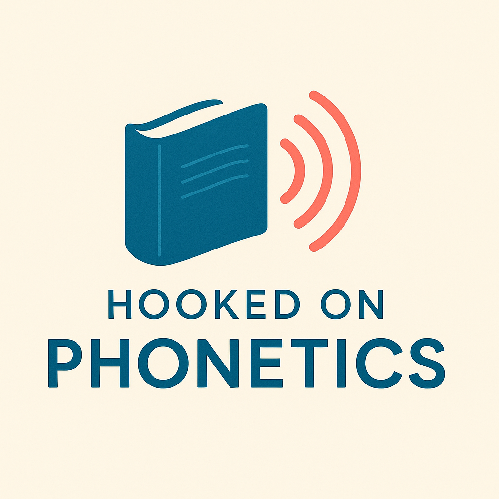

# Hooked On Phonetics

### A revolutionary literacy platform transforming how we teach reading and writing skills

 

## 🚀 Experience the Future of Literacy Education

**Hooked On Phonetics** is more than just an app—it's a comprehensive educational ecosystem designed to revolutionize how we teach and learn literacy skills. After thousands of hours of research, development, and testing, I'm proud to share this project with the world.

### [✨ Try the Live Application](https://hookedonphonetics-d58c3.web.app/)

## 🌟 Why This Project Matters

In today's digital world, strong literacy skills remain the foundation of all learning. Yet traditional approaches often fail to engage students or adapt to their individual needs. Hooked On Phonetics addresses this challenge by combining:

- **Evidence-based literacy science** with cutting-edge technology
- **Adaptive learning algorithms** that personalize the experience for each user
- **Engaging, game-like interfaces** that make learning enjoyable and effective
- **Comprehensive progress tracking** for educators and learners

## 🧠 The Science Behind the Magic

Hooked On Phonetics is built on an "Integrated Structured-Literacy Stack" that combines the most effective approaches to literacy instruction:

| Layer                      | Approach                     | Implementation                                             |
| -------------------------- | ---------------------------- | ---------------------------------------------------------- |
| **Phonology → Phonics**    | Sound-letter connections     | Interactive sound-swap games and visual phoneme mapping    |
| **Syllables & Morphology** | Word structure analysis      | Color-coded morpheme visualization and pattern recognition |
| **Fluency Development**    | Guided reading practice      | Timed passages with prosody coaching and instant feedback  |
| **Comprehension Building** | Strategic reading techniques | Interactive story mapping and context analysis tools       |
| **Writing & Expression**   | Structured writing process   | Guided composition with revision support and peer feedback |

## 🛠️ Key Features That Set Us Apart

### Adaptive Learning Engine

The platform uses Bayesian Knowledge Tracing and Item Response Theory to create a truly personalized learning path for each user, ensuring they're always working at the optimal challenge level.

### Interactive Modules

- **Phonics Playground**: Gamified phonological awareness exercises
- **Fluency Studio**: Real-time reading assessment with audio feedback
- **Morphology Lab**: Word-building with visual morpheme analysis
- **Context Detective**: Vocabulary development through contextual analysis
- **Writing Workshop**: Structured composition with AI-assisted feedback

### Progress Visualization

The hexagonal skill tree provides a visual representation of learning progress, helping users see their growth and identify areas for improvement.

## 💡 Why Support This Project?

Developing educational technology that truly makes a difference requires enormous investment of time, expertise, and resources. Your support helps:

- **Maintain and improve** the platform for current users
- **Expand accessibility** to reach more learners, especially those with limited resources
- **Develop new features** based on educator and student feedback
- **Research and implement** the latest advances in literacy science

## ☕ Fuel the Next Phase of Development

If you believe in the power of education to transform lives, consider supporting this project. Every contribution helps bring effective literacy tools to more learners around the world.

## 🔗 Connect & Learn More

- **Live Application**: [https://hookedonphonetics-d58c3.web.app/](https://hookedonphonetics-d58c3.web.app/)
- **Developer**: [GitHub @RorriMaesu](https://github.com/RorriMaesu)
- **Support**: [Buy Me A Coffee](https://buymeacoffee.com/rorrimaesu)

## 🚀 Technical Highlights

- **Progressive Web App** with offline functionality and install-to-home-screen capability
- **Real-time collaboration** features for educators and learners
- **Cloud-based architecture** for seamless updates and scalability
- **Responsive design** that works on all devices from smartphones to desktops
- **AI-powered content generation** for personalized learning materials

## 📱 Available Everywhere

Access Hooked On Phonetics on any device with a web browser:

- **Desktop computers** for classroom and home use
- **Tablets** for interactive learning sessions
- **Smartphones** for on-the-go practice
- **Interactive whiteboards** for group instruction

---

Thank you for exploring Hooked On Phonetics!

Your support makes a difference in the future of literacy education.

